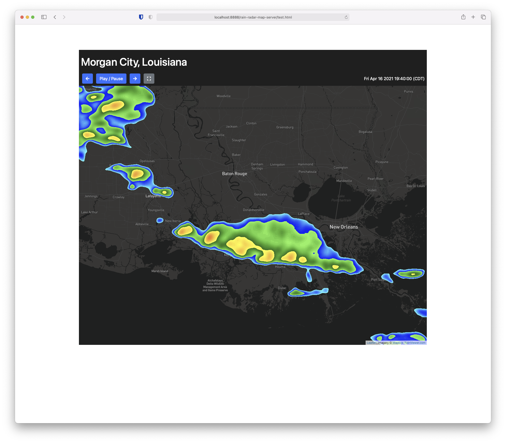
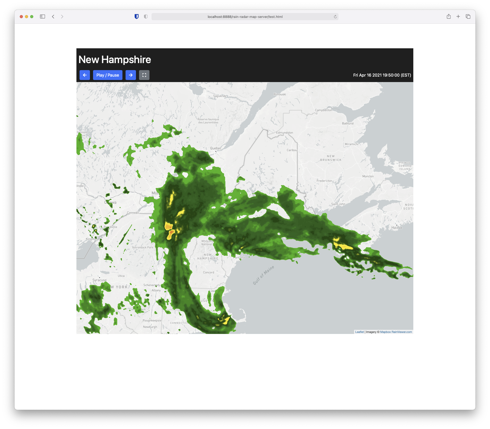
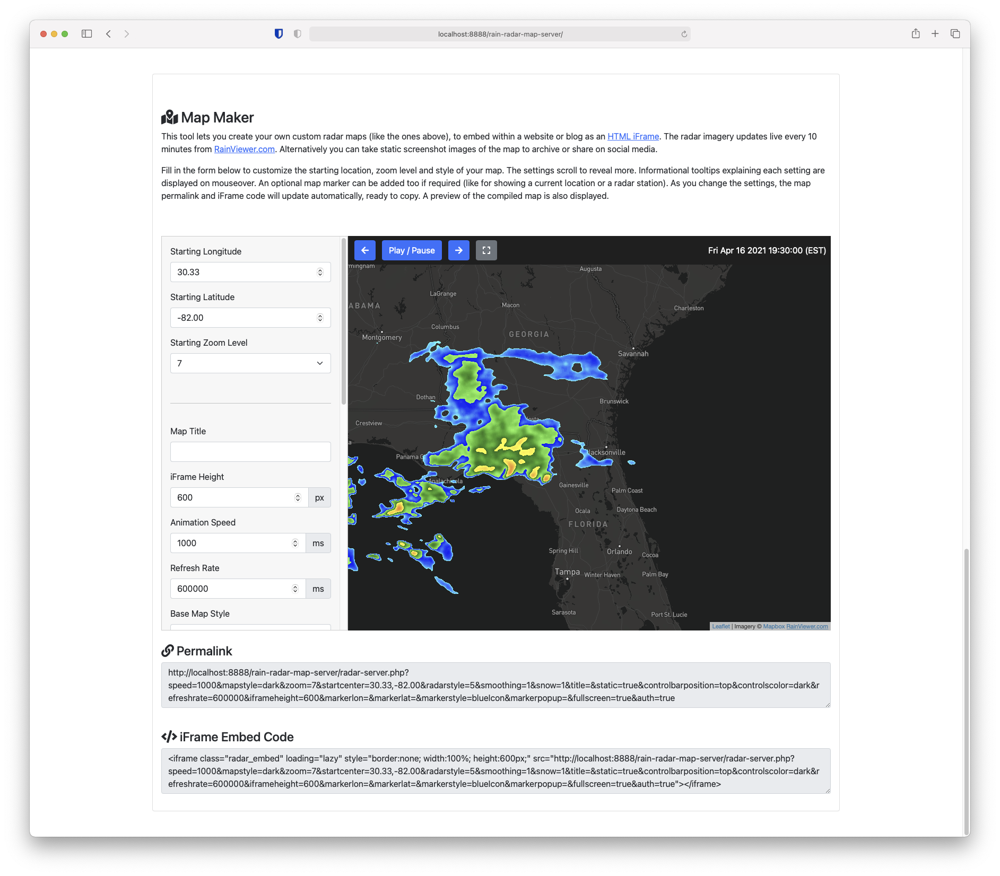

Radar Map Viewer
=====================

## What is it?

A small web application coded in PHP, that you host yourself on a web server. It lets you display an interactive rain radar, inside an iFrame.

Radar Map Viewer (RMV) is powered using [Leaflet.js](https://leafletjs.com/) mapping, [Mapbox](https://www.mapbox.com/) imagery, [Twitter Bootstrap](https://getbootstrap.com/) 5 + [Font Awesome Icons](https://fontawesome.com/) for the user interface, [leaflet-color-markers](https://github.com/pointhi/leaflet-color-markers) for an optional map pin and the [RainViewer.com API](https://www.rainviewer.com/api.html) for live radar imagery. 



RMV was originally developed for [Hurricanetrack.com](Hurricanetrack.com) to generate live-updating radar charts, which could easily get embedded in websites and blogs, ahead of hurricanes and other high-impact weather events in the US and worldwide. RMV is a good alternative to ugly GIF animations or embedded 'widgets' that often carry unwanted advertising and user tracking.

It's been found that RMV works great on all modern web browsers, including devices with a high-resolution (retina) display. As you would expect, it's fully mobile-first responsive, so users on smartphones and tablets get a great viewing experience too.

## How does it work?

You send the RMV a [query string](https://en.wikipedia.org/wiki/Query_string) like this:

```radar-server.php?speed=1000&mapstyle=dark&zoom=8&startcenter=30.40,-84.26&radarstyle=5&smoothing=1&snow=1&title=Tallahassee,%20FL&static=true&controlbarposition=top&controlscolor=dark&refreshrate=600000&iframeheight=50vh&markerlon=&markerlat=&markerpopup=&fullscreen=true```

Typically you would have the query string inside an [HTML iFrame](https://www.w3schools.com/tags/tag_iframe.asp) like this:

```<iframe class="radar_embed" loading="lazy" style="border:none; width:100%; height:600px;" src="radar-server.php?speed=1000&mapstyle=dark&zoom=8&startcenter=30.40,-84.26&radarstyle=5&smoothing=1&snow=1&title=Tallahassee,%20FL&static=true&controlbarposition=top&controlscolor=dark&refreshrate=600000&iframeheight=50vh&markerlon=&markerlat=&markerpopup=&fullscreen=true"></iframe>```

RMV receives this query string, then generates and returns the radar map for that particular region, configured to how you want it to look.

At the top of the map, you can display the location name, navigation controls (including an optional fullscreen button) and the current timezone. Website users can easily view and interact with the map. Radar coverage extends to include most of the world. The map can be configured to update 'live', to save users from needing to manually refresh the webpage. This is what a typical map looks like:



## Installing and using RMV

Download the ZIP archive from the Github page. Upload the extracted directory to any web server running PHP 7.6 or later (including MAMP / LAMP or other local testing environments). In a webpage, create an iFrame and set the SRC attribute value as a link to your RMV, with a query string of properties (see below) or use the included 'Map Maker' tool.

## Query string properties

Query strings get sent to the PHP file. They customize the position and style of the map returned.

| Query String | Type | Description |
|:-------------:|:-------------:|:-----:|
|speed|integer|Sets the speed of the radar animation loop, in milliseconds.|
|mapstyle|string|Controls the style of the base map. Possible string values can be either ```dark```, ```light``` or ```osm``` (Open Street Map).|
|zoom|integer|The default zoom level tha that the map should start at. Enter a value between 1 and 10.|
|startcenter|float|The starting longitude and latitude of the map center, in decimal format (i.e. ```34.21,-77.94```).|
|radarstyle|integer|The reference number of the radar style you want to use. Rainviewer supports 7 radar styles (Original, Universal Blue, TITAN, The Weather Channel, NEXRAD Level-3, Rainbow @ SELEX-SI, Dark Sky) so enter a corresponding number between 1 and 7.|
|smoothing|integer|Enter ```0``` for no radar smoothing or ```1``` to apply radar smoothing.|
|snow|integer|Enter ```0``` for no frozen precipitation or ```1``` to display frozen precipitation.|
|title|string|An optional title for the radar map, displayed at the top.|
|static|boolean|Enter ```true``` or ```false```. If the map is static, then the end user cannot pan or zoom to change its position. Zooming and panning Leaflet map controls will be hidden in a static map.|
|controlbarposition|string|Enter either ```top``` or ```bottom```. As the name suggests, this query string changes the position of the control bar.|
|controlscolor|string|Enter either ```dark``` or ```light```. This changes the background color of the control bar and text coloring, like an optional title.|
|refreshrate|integer|How often the map should reload (refresh). This time is specified in milliseconds.|
|iframeheight|integer|The height of the iFrame, in pixels. Optionally you could change this via CSS too, and use alternative units, like viewport height (vh).|
|fullscreen|boolean|Enter ```true``` or ```false```. This toggles the display of a fullscreen button, alongside the radar animation controls.
|markerlon|float|Optional, the longitude of a map marker (map pin).|
|markerlat|float|Optional, the latitude of a map marker (map pin).|
|markerstyle|string|Optional, color of a map marker (using [leaflet-color-markers](https://github.com/pointhi/leaflet-color-markers).|
|markerpopup|string|Text or HTML markup to display within an optional map pin popup.|

These final 4 query strings are optional. They allow you to plot a single map pin over the map, which can be clicked to reveal a small popup window of content. Such uses could include marking your current location on the map or the center of an urban area etc.

## Using the Map Maker tool

If you open the index.html file in your web browser, you'll see a couple of examples of the maps RMV can create (RMV must be on a functioning server, in order to view the sample maps). If you scroll towards the bottom of the page, I have added a tool for you to generate your own maps, with this friendly user interface:



This tool basically bundles all the above query string properties into a real map you can test and experiment with. As you change the settings, the map preview will update live. Once you're happy with the map, you can use the permalink or iFrame embed code to reuse the map elsewhere.

## A word about caching

Some web browsers (like Firefox) cache iFrames very heavily. It's not clear if this is a bug or simply their attempt to cheat at speed tests! One thing to be aware of is that if the code or placement of your iFrame changes in a webpage, the original iFrame may persist, even if you empty the browser cache. I found it is sometimes necessary to completely restart the web browser, before changes will show.

## License

RMV is FOSS (free and open source software) and is released under the MIT license. You are basically free to do whatever you want with it. A credit would be appreciated. I'm usually available for hire if you need RMV customised, supported or extended further. Little weather tools like RMV are one of my specialities.  I'm always happy to chat and discuss your requirements! You can [get in touch](https://willwoodgate.com/) via my website.
